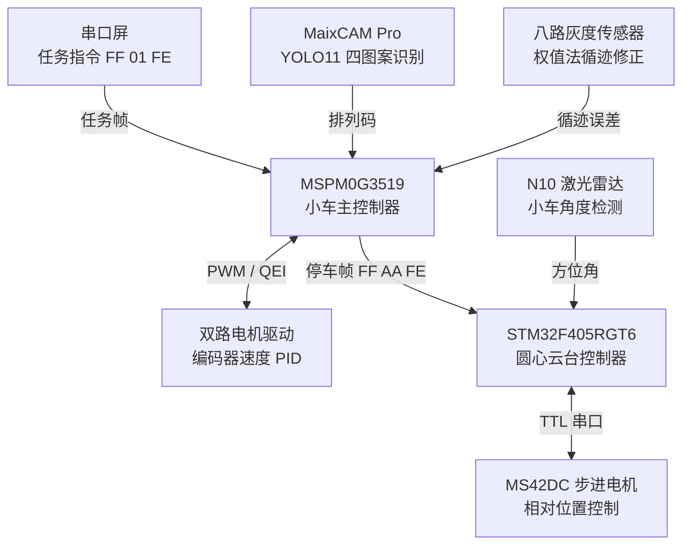
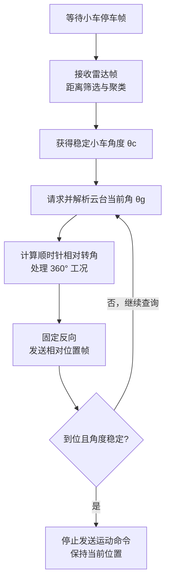

[README.md](https://github.com/user-attachments/files/30355839/README.md)
<h1 align="center">小车与一维云台联合控制系统设计</h1>

<p align="center"><strong>全国大学生电子设计竞赛 · 任务实施方案</strong></p>

<p align="center">圆形巡线 · 四图案排列识别 · 目标信息保存 · 一维云台联动控制</p>

| 项目 | 信息 |
|---|---|
| 作品编号 | `010101` |
| 参赛学校 | 西安电子科技大学 |
| 参赛队员 | 张明诚、李晨、李东航 |
| 完成日期 | 2026 年 7 月 18 日 |

## 项目简介

本项目设计一套由自主移动小车、圆心一维云台及视觉标志板构成的联合控制系统。小车以 **MSPM0G3519** 为主控制器，采用双轮差速底盘、双编码器速度 PID 与八路灰度循迹；视觉端使用 **MaixCAM Pro + YOLO11** 恢复四图案空间排列；云台端使用 **STM32F405RGT6、N10 激光雷达与 MS42DC 驱控一体步进电机**，在小车停车后完成顺时针联动对准。

> **关键参数：**轨迹半径 60 cm；轮距 11.5 cm；车轮直径 65 mm；编码器输出轴每圈 1456 计数；理想左右轮速比约 1.212。

**关键词：** 差速小车 · 圆形巡线 · 速度 PID · 权值法 · YOLO11 · 激光雷达 · 一维云台

## 目录

- [任务要求与总体设计目标](#任务要求与总体设计目标)
- [系统方案论证与选择](#系统方案论证与选择)
- [理论分析与参数计算](#理论分析与参数计算)
- [硬件系统设计](#硬件系统设计)
- [通信协议设计](#通信协议设计)
- [软件系统设计](#软件系统设计)
- [系统标定与测试方案](#系统标定与测试方案)
- [实施计划与预期成果](#实施计划与预期成果)
- [方案特点与可行性总结](#方案特点与可行性总结)
- [参考资料](#参考资料)

---

# 任务要求与总体设计目标

## 任务理解

系统由自主移动小车、固定在圆形轨迹圆心的一维旋转云台以及安装在云台上的视觉标志板组成。任务一启动后，小车沿半径 $R=60\,\mathrm{cm}$ 的黑色圆形轨迹顺时针自主运行，在运动过程中识别标志板四个区域内的全部图案，恢复完整排列关系，解析并保存对应的目标角度；完成一周后，小车返回起始位置附近停车。小车停止后向圆心云台发送联动消息，云台根据激光雷达检测到的小车方位调整标志板朝向。

本方案将任务分解为以下六个闭环环节：

1.  串口屏任务指令接收与状态机启动；
2.  左、右轮速度闭环及顺时针圆周运动控制；
3.  灰度传感器权值误差计算与小幅循迹修正；
4.  MaixCAM Pro 四目标检测、象限排序与排列码生成；
5.  一周里程判断、停车、结果保存及联动消息发送；
6.  雷达测角、云台绝对角读取、顺时针相对角计算与位置控制。

## 设计指标

| 序号 | 指标项目       | 方案目标                                                           |
|:----:|:---------------|:-------------------------------------------------------------------|
|  1   | 圆形轨迹运行   | 沿半径 60 cm、线宽约 1.8 cm 的黑线顺时针运行一周，运行中不完全脱线 |
|  2   | 起点停车       | 完成一周后车体中心距起始点不超过 5 cm                              |
|  3   | 图案识别       | 同时识别四个图案，并按左上、右上、左下、右下生成完整排列码         |
|  4   | 目标信息保存   | 将排列码及对应目标角度保存到掉电保持存储区或校验后的非易失存储区   |
|  5   | 云台启动       | 小车停车前云台不运动；停车消息到达后在 3 s 内启动                  |
|  6   | 云台方向与精度 | 固定顺时针旋转，标志板最终朝向小车，目标方向误差不超过 $5^{\circ}$ |

<p align="center"><sub>任务一主要设计指标</sub></p>

# 系统方案论证与选择

## 总体架构

系统采用“小车控制域—视觉控制域—云台控制域”三级分布式结构。小车控制域负责实时运动控制和任务调度；视觉控制域负责神经网络推理和图案空间关系解析；云台控制域负责雷达数据处理和步进电机位置控制。各控制域之间使用串口通信，便于模块独立调试并降低主控实时任务之间的相互干扰。

### 系统总体结构框图




## 小车主控制器方案

小车选用 MSPM0G3519（LQ64 封装）作为主控制器。该器件具有足够的定时器、QEI、PWM、UART、SPI 及 GPIO 资源，可同时承担双电机 PWM 控制、两路正交编码器采集、灰度传感器读取、串口屏通信、视觉通信及云台通信等任务。实时控制采用固定周期调度：编码器速度采样及速度 PID 周期建议设为 20 ms，循迹误差更新周期建议为 5 ms 至 10 ms，任务状态机在主循环中非阻塞执行。

串口屏仅用于任务选择和状态显示，不直接遥控小车运动。任务一采用三字节定长帧：

$$
\underbrace{\mathtt{FF}}_{\text{帧头}}\quad
  \underbrace{\mathtt{01}}_{\text{任务一}}\quad
  \underbrace{\mathtt{FE}}_{\text{帧尾}} .
$$

主控在串口中断中完成逐字节解析，将合法任务号写入队列；运动控制在主循环状态机中执行，避免在中断服务程序内直接运行耗时任务。

## 底盘驱动与检测方案

底盘采用两轮差速加随动支撑结构。左右直流减速电机分别由独立 PWM 通道驱动，电机方向由 GPIO 控制。每个电机配备 13 线 AB 相增量编码器，定时器 QEI 模式进行 4 倍频计数，减速比为 $1{:}28$。与仅采用开环 PWM 相比，双轮速度闭环能够抑制电池电压变化、电机个体差异和负载变化造成的速度偏差；与完全依赖循迹误差控制相比，“运动学基础差速+小幅循迹修正”能够保留圆周运动前馈关系，减小控制量突变。

## 视觉识别方案

视觉模块采用 MaixCAM Pro，部署 YOLO11 目标检测模型。网络一次推理输出四个图案的类别、置信度和边界框。算法不以任意单个图案作为目标角度判据，而是在确认四类目标均有效后，根据检测框中心坐标恢复完整空间排列。选择该方案的原因如下：

- 部分图案具有中心对称性，单个目标的局部特征不能唯一确定整块标志板的排列状态；
- 同时识别四个图案可结合类别和空间位置进行双重校验；
- YOLO11 可在 MaixCAM Pro 上完成端侧推理，避免把图像传输给小车主控造成带宽和实时性压力；
- 视觉模块只输出紧凑排列码，便于与 MSPM0G3519 进行可靠串口通信。

## 云台执行方案

云台主控选用 STM32F405RGT6，一路高速串口接收 N10 激光雷达数据，一路串口与小车通信，另一路 TTL 串口控制 MS42DC 驱控一体步进电机。云台机械零点、标志板正面法线零点与雷达角度零点在装配时统一标定。

电机采用相对位置控制模式，而不直接采用“最短路径”的单圈绝对角度控制。STM32 首先读取当前云台绝对角度，再根据雷达检测的小车角度计算所需顺时针相对转角，最后固定发送实测对应顺时针的 “反向”位置控制命令。这样无论云台底座和串口屏在测试前如何摆放，只要三者零点关系保持固定，控制器均可根据实时角度完成闭环计算。

# 理论分析与参数计算

## 差速小车正运动学模型

设左右轮线速度分别为 $v_L$、$v_R$，两轮中心间距为 $b$，车体几何中心线速度为 $v$，以逆时针为车体角速度正方向，则两轮差速小车的正运动学模型为

$$
v=\frac{v_L+v_R}{2},\qquad
  \omega=\frac{v_R-v_L}{b}.
$$

车体位姿为 $\boldsymbol{q}=[x,y,\psi]^{\mathrm T}$，其连续运动方程为

$$
\dot{x}=v\cos\psi,\qquad
  \dot{y}=v\sin\psi,\qquad
  \dot{\psi}=\omega.
$$

当 $v_L>v_R$ 时，$\omega<0$，小车向右侧即顺时针方向转弯，符合本题圆形轨迹的运动要求。

## 逆运动学与固定轮速比

由上式可得逆运动学模型

$$
v_L=v-\frac{b}{2}\omega,\qquad
  v_R=v+\frac{b}{2}\omega.
$$

对半径为 $R$ 的顺时针圆周运动，有

$$
\omega=-\frac{v}{R}.
$$

代入上式得到

$$
v_L=v\left(1+\frac{b}{2R}\right),\qquad
  v_R=v\left(1-\frac{b}{2R}\right).
$$

因此左右轮基础速度比为

$$
k_v=\frac{v_L}{v_R}
  =\frac{R+b/2}{R-b/2}.
$$

取 $R=60\,\mathrm{cm}$、$b=11.5\,\mathrm{cm}$，则

$$
k_v=\frac{60+5.75}{60-5.75}
  =\frac{65.75}{54.25}\approx 1.212.
$$

即在理想条件下，顺时针运动时左轮为外侧轮，左轮线速度约为右轮的 $1.212$ 倍。实际控制中先给定右轮基础目标速度 $v_{R0}$，再令

$$
v_{L0}=1.212\,v_{R0}.
$$

## 车轮转速与编码器计数换算

车轮直径为 $D=65\,\mathrm{mm}$，半径为 $r_w=32.5\,\mathrm{mm}$。车轮角速度与线速度关系为

$$
\omega_w=\frac{v_w}{r_w},\qquad
  n_w=\frac{60v_w}{2\pi r_w},
$$

其中 $n_w$ 的单位为 r/min。

编码器每转 13 线，AB 相 4 倍频，减速比为 $28$，因此车轮输出轴每转计数为

$$
N_{\mathrm{rev}}=13\times 4\times 28=1456.
$$

在采样周期 $T_s=20\,\mathrm{ms}$ 内得到增量计数 $\Delta N$，轮端转速为

$$
n=\frac{60\Delta N}{N_{\mathrm{rev}}T_s}
  =\frac{60\Delta N}{1456\times 0.02}
  \approx 2.0604\Delta N\quad \mathrm{r/min}.
$$

该换算结果作为左右轮速度 PID 的实际值输入。累计计数还可用于估计两轮行程：

$$
s_L=\frac{N_L}{1456}\pi D,\qquad
  s_R=\frac{N_R}{1456}\pi D.
$$

车体中心累计弧长和绕圆心累计角度分别近似为

$$
s_c=\frac{s_L+s_R}{2},\qquad
  \Phi=\frac{s_c}{R}.
$$

当 $\Phi$ 接近 $2\pi$ 且起点区域特征再次出现时，状态机进入减速停车阶段。采用“里程阈值+起点特征”双条件可避免刚启动时误判已回到起点。

## 双轮速度 PID 控制

左右轮分别构成独立速度闭环。以某一车轮为例，设目标转速为 $n^{\star}(k)$，实测转速为 $n(k)$，误差为

$$
e_v(k)=n^{\star}(k)-n(k).
$$

离散位置式 PID 控制量为

$$
u(k)=K_p e_v(k)+K_i\sum_{i=0}^{k}e_v(i)
       +K_d\left[e_v(k)-e_v(k-1)\right].
$$

控制量经限幅后转换为 PWM 占空比。为防止停车或饱和状态下积分累积，软件中对积分项设置上下限，并在任务开始、急停和模式切换时清零 PID 历史状态。参数整定顺序为：先令 $K_i=K_d=0$ 调整 $K_p$ 获得足够响应，再增加小量 $K_i$ 消除稳态误差，最后根据机械振动情况加入 $K_d$ 抑制超调。

## 灰度权值法与小幅循迹修正

设八路灰度传感器由左至右编号为 $i=0,1,\ldots,7$，二值检测结果为 $g_i\in\{0,1\}$，权值选为

$$
w_i=[-4,-3,-2,-1,1,2,3,4].
$$

当至少一个通道检测到黑线时，横向误差定义为

$$
e_t=\frac{\sum_{i=0}^{7}w_i g_i}{\sum_{i=0}^{7}g_i}.
$$

对误差进行限幅和低通处理后，采用 PD 或小增益 PID 得到循迹修正量

$$
\Delta v=K_{tp}e_t+K_{td}\left[e_t(k)-e_t(k-1)\right].
$$

规定 $e_t>0$ 表示黑线位于车体右侧，需要增加顺时针转向趋势，则最终左右轮目标速度为

$$
\begin{aligned}
    v_L^{\star}&=v_{L0}+\Delta v,\\
    v_R^{\star}&=v_{R0}-\Delta v.
  \end{aligned}
$$

其中 $|\Delta v|$ 必须限制在基础速度的较小比例内，使权值法只负责纠偏，不破坏上式给出的圆周运动主差速关系。当灰度状态无有效匹配时，短时间保持上一次误差；超过设定丢线时间后，降低车速并按最后偏差方向搜索，防止错误大幅转向。

## 四图案排列恢复与目标角度解析

YOLO11 对每个图案输出类别 $c_j$、检测框中心 $(x_j,y_j)$ 和置信度 $p_j$。仅保留置信度高于阈值 $p_{\min}$ 的结果，并执行以下处理：

1.  对同类别重复框进行非极大值抑制，仅保留最高置信度框；
2.  确认 A、B、C、D 四类图案均出现且总数为 4；
3.  计算四个中心坐标的均值 $(\bar{x},\bar{y})$，作为标志板十字分区中心；
4.  根据 $x_j$ 与 $\bar{x}$、$y_j$ 与 $\bar{y}$ 的大小关系划分左上、右上、左下、右下；
5.  按固定顺序拼接排列码，并通过查表得到目标角度。

| 方式 | 左上 | 右上 | 左下 | 右下 |   目标角度    |
|:----:|:----:|:----:|:----:|:----:|:-------------:|
|  1   |  A   |  B   |  C   |  D   | $90^{\circ}$  |
|  2   |  D   |  C   |  B   |  A   | $180^{\circ}$ |
|  3   |  A   |  C   |  B   |  D   | $270^{\circ}$ |
|  4   |  C   |  B   |  D   |  A   | $360^{\circ}$ |

<p align="center"><sub>排列码与目标角度映射</sub></p>

为提高鲁棒性，视觉模块连续多帧识别，只有同一排列码连续稳定出现 $M$ 次后才置为有效。小车主控对收到的排列码再次进行合法性检查，然后保存“排列码、目标角度、校验字节和有效标志”。

## 雷达测角与云台顺时针相对转角模型

建立统一角度坐标系：以雷达零点和云台机械零点为 $0^{\circ}$，逆时针为正。设雷达检测到的小车方位角为 $\theta_c\in[0,360^{\circ})$，云台当前绝对角为 $\theta_g\in[0,360^{\circ})$，标志板正面相对云台零点的安装补偿角为 $\theta_0$，则目标绝对角为

$$
\theta_t
=\left(\theta_c-\theta_0+360^{\circ}\right)
\;\mathrm{mod}\; 360^{\circ}.
$$

若云台只允许顺时针转动，顺时针相对转角应为

$$
\Delta\theta_{\mathrm{cw}}
=\left(\theta_g-\theta_t+360^{\circ}\right)
\;\mathrm{mod}\; 360^{\circ}.
$$

当计算结果落入零角死区 $[0,\varepsilon]$ 时，为保证 $360^{\circ}$ 工况仍执行完整旋转过程，可令

$$
\Delta\theta_{\mathrm{cmd}}=
  \begin{cases}
    360^{\circ}, & 0\leq \Delta\theta_{\mathrm{cw}}\leq\varepsilon,\\
    \Delta\theta_{\mathrm{cw}}, & \text{其他情况}.
  \end{cases}
$$

实际装配中固定使用经实验确认对应云台顺时针的电机“反向”标志。该方法不依赖云台上电时的绝对朝向，只依赖雷达零点、云台零点及标志板法线之间的固定标定关系。

雷达点云中小车内侧距离圆心约为 50 cm 至 60 cm。软件先按距离窗口筛选候选点，再按角度连续性与距离连续性聚类；选择连续点数最多且多帧稳定的点簇，其角度中位数或距离加权平均值作为 $\theta_c$。该处理可抑制黑线、支架和场地边缘产生的孤立测距点。

# 硬件系统设计

## 小车硬件组成

| 模块     | 选型/参数            | 主要功能                                           |
|:---------|:---------------------|:---------------------------------------------------|
| 小车主控 | MSPM0G3519，LQ64     | 任务状态机、PWM、QEI、灰度读取、串口通信、数据保存 |
| 驱动电机 | 两路直流减速电机     | 形成左外轮、右内轮基础差速并执行循迹修正           |
| 编码器   | 13 线、AB 相、4 倍频 | 轮速闭环和累计里程测量                             |
| 减速机构 | $1{:}28$             | 提高输出转矩，降低轮端速度                         |
| 车轮     | 直径 65 mm           | 将轮端角速度转换为车体线速度                       |
| 灰度阵列 | 八路数字灰度传感器   | 识别黑色轨迹并计算横向偏差                         |
| 视觉模块 | MaixCAM Pro          | YOLO11 推理、四图案空间排列解析                    |
| 人机交互 | 串口屏               | 下发任务一指令、显示状态和识别结果                 |

<p align="center"><sub>小车主要硬件模块及功能</sub></p>

小车电源采用车载电池供电，电机功率地与逻辑地在电源入口处可靠共地。电机驱动附近布置大容量储能电容，主控和传感器电源分别布置去耦电容。编码器输出电平必须与 MSPM0G3519 I/O 电平兼容，必要时增加电平转换或限流保护。电机线与编码器、灰度及串口信号线分开布线，以降低 PWM 开关噪声影响。

## 云台硬件组成

云台采用 STM32F405RGT6 作为控制器，N10 激光雷达固定在云台基座坐标系中，雷达零点与云台零点对齐。MS42DC 驱控一体步进电机带内部位置闭环，STM32 通过 TTL 串口下发相对位置命令并读取状态反馈。雷达、STM32 和步进电机通信地必须共地；步进电机动力电源与控制器逻辑电源分别滤波，避免电机加减速电流造成主控复位。

## 接口分配原则

本方案不在项目方案书中固化具体管脚号，而按以下原则完成原理图与 SysConfig/CubeMX 分配：

- 两路支持 QEI 的定时器分别连接左右编码器 AB 相；
- 两路硬件 PWM 输出连接左右电机驱动使能端；
- 串口屏、MaixCAM Pro、调试接口和云台通信分别使用独立 UART；
- 灰度传感器使用连续 GPIO 或并行读取方便的端口；
- 云台侧雷达串口优先使用 DMA 循环接收，电机和小车通信使用独立 UART；
- 所有外设接口预留测试点，便于示波器和逻辑分析仪联调。

# 通信协议设计

## 串口屏至小车

串口参数建议统一为 115200 bit/s、8 数据位、1 停止位、无校验。协议采用三字节定长帧，如表 “串口屏任务一协议” 所示。

| 字节序号 |   0    |   1    |   2    |
|:--------:|:------:|:------:|:------:|
|   字段   |  帧头  | 任务号 |  帧尾  |
|   数值   | `0xFF` | `0x01` | `0xFE` |

<p align="center"><sub>串口屏任务一协议</sub></p>


解析器在任意状态再次收到 `0xFF` 时重新同步，合法帧写入任务队列，主循环读取任务后进入任务一状态机。

## MaixCAM Pro 至小车

视觉串口帧结构为

```text
FF N DATA[0] ... DATA[N-1] BCC FE
```

其中 $N$ 为有效数据字节数，异或校验可写为

```c
BCC = 0xFF ^ N ^ DATA[0] ^ ... ^ DATA[N - 1];
```

本方案建议数据区至少包含排列方式、四个象限类别、平均置信度和帧序号。小车只接受长度正确、BCC 正确且排列码属于四种合法状态的帧；多帧未及时处理时只保留最新有效结果。

## 小车至云台

小车停车并完成电机锁止后发送联动帧：

```text
FF AA FE
```

表示“任务一小车已停止，允许云台开始测角和旋转”。云台控制器仅在完整匹配该帧后锁存启动事件，避免雷达串口数据中偶然出现单字节相同值造成误触发。系统复位或异常停止可预留独立停止帧，并在云台侧优先级最高地执行零力矩/停止控制。

## STM32 至 MS42DC 步进电机

MS42DC 的 TTL 串口位置控制命令采用 11 字节帧：

| 帧头 | 地址 | 模式 | 方向 | 细分 | 位置高字节 | 位置低字节 | 速度高字节 | 速度低字节 | BCC | 帧尾 |
|:---:|:---:|:---:|:---:|:---:|:---:|:---:|:---:|:---:|:---:|:---:|
| `7B` | `ID` | `02` | `00` | `20` | `POS_H` | `POS_L` | `SPD_H` | `SPD_L` | `XOR` | `7D` |


<p align="center"><sub>MS42DC 相对位置控制帧</sub></p>


其中模式 `0x02` 为相对位置控制，方向 `0x00` 在本云台机构上经实测对应顺时针，`0x20` 表示 32 细分；位置按 $0.1^{\circ}$ 放大后发送，速度以 rad/s 为单位放大 10 倍发送。BCC 为前 9 个字节的异或和。

若计算得到命令角度为 $\Delta\theta_{\mathrm{cmd}}$，由于命令角度为非负值，可用下式完成四舍五入：

$$
P=\left\lfloor
10\Delta\theta_{\mathrm{cmd}}+0.5
\right\rfloor.
$$

位置字段的高、低字节使用 C 位运算拆分：

```c
uint16_t position = (uint16_t)P;
uint8_t POS_H = (uint8_t)((position >> 8) & 0xFF);
uint8_t POS_L = (uint8_t)(position & 0xFF);
```

电机状态采用请求反馈方式。STM32 发送：

```text
7B 01 00 00 00 00 00 00 00 7A 7D
```

请求实时速度和位置。反馈数据中的位置为带符号 32 位数并放大 10 倍；控制器完成 BCC 校验后再更新角度状态。请求式反馈可避免连续反馈占用串口带宽。

# 软件系统设计

## 任务一状态机

任务一采用显式状态机而不是长时间阻塞延时。建议状态定义见表“任务一状态划分”。

| 状态     | 主要操作                                   | 转移条件                   |
|:---------|:-------------------------------------------|:---------------------------|
| WAIT     | 等待串口屏任务一帧，电机停止               | 收到 `FF 01 FE`            |
| INIT     | 清零编码器、PID、循迹误差和视觉有效标志    | 初始化完成                 |
| RUN      | 圆周基础差速、速度 PID、权值循迹、视觉接收 | 累计角度接近 $2\pi$        |
| APPROACH | 降低目标速度，检测起点区域，抑制过冲       | 起点条件稳定成立           |
| STOP     | 左右轮目标速度斜坡降至 0，确认车体停止     | 速度低于阈值并持续若干周期 |
| SAVE     | 保存排列码、目标角度及校验字节             | 写入并校验成功             |
| LINK     | 向云台发送 `FF AA FE`                      | 发送完成                   |
| DONE     | 保持停止并显示任务结果                     | 新任务或系统复位           |

<p align="center"><sub>任务一状态划分</sub></p>


### 小车任务一软件流程


## 周期任务调度

建议采用硬件定时器产生基础节拍，各任务按倍频执行：

|       软件任务       | 建议周期 |            主要内容            |
|:--------------------:|:--------:|:------------------------------:|
|  灰度采样与误差计算  |   5 ms   |   并行读取、权值法、丢线检测   |
| 编码器采样与速度 PID |  20 ms   |  读取 QEI、转速换算、双轮 PID  |
|      视觉帧处理      | 事件触发 | BCC 校验、排列合法性、多帧确认 |
|      任务状态机      |  主循环  |   状态转移、停车、保存和联动   |
|      串口屏刷新      |  100 ms  |  显示状态、误差、排列码和角度  |

<p align="center"><sub>小车主要软件任务周期</sub></p>

所有中断只完成采样、字节接收、计数更新和标志位置位，复杂运算放在主循环执行。共享变量按实际访问方式使用 `volatile`，但在高频中断内先复制到局部变量，避免重复内存访问增加执行时间。

## 视觉处理流程

MaixCAM Pro 软件流程为：摄像头采集 $\rightarrow$ 图像预处理 $\rightarrow$ YOLO11 推理 $\rightarrow$ 置信度筛选与 NMS $\rightarrow$ 四象限排序 $\rightarrow$ 连续多帧一致性判断 $\rightarrow$ 串口发送。模型训练时应包含不同距离、不同光照、轻微倾斜和背景变化的数据增强，同时保证四种图案在同一训练图像中出现，以学习完整标志板场景。

## 云台控制流程

### 云台联动控制流程




雷达测角和电机位置反馈分别设置超时保护。若在规定时间内未获得稳定小车点簇、反馈校验失败或电机长时间未到位，系统立即停止继续下发运动指令，保留故障码并通过调试串口输出。

# 系统标定与测试方案

## 机械与传感器标定

1.  **轮距标定：**以 11.5 cm 为初值，在低速圆周运行中根据实际轨迹半径修正等效轮距；
2.  **轮径标定：**左右轮分别运行固定编码器计数，测量实际行程并修正等效轮径；
3.  **电机方向标定：**确认左、右电机正负 PWM 与小车前进方向的对应关系；
4.  **灰度权值标定：**记录黑线位于各通道时的状态，统一正负误差方向；
5.  **视觉坐标标定：**确认图像坐标系与左上、右上、左下、右下的对应关系；
6.  **云台零点标定：**使雷达零线、云台零位和标志板正面基准线重合，测得安装补偿角 $\theta_0$；
7.  **云台方向标定：**以小角度位置命令确认协议“反向”在实际机构上对应顺时针旋转。

## 分模块测试

| 测试项目   | 测试方法                              | 通过判据                                   |
|:-----------|:--------------------------------------|:-------------------------------------------|
| 编码器计数 | 手动转动车轮一周并读取累计 QEI        | 单轮约 1456 计数，正反转符号正确           |
| 速度闭环   | 分别给定多组目标转速，记录阶跃响应    | 稳态误差小，无持续振荡，左右轮均可稳定跟踪 |
| 基础圆周   | 关闭循迹修正，仅使用 $1.212$ 固定比例 | 低速运行轨迹接近半径 60 cm 圆周            |
| 循迹修正   | 人为改变轮胎负载或初始横向位置        | 能平滑回到黑线，修正量无突跳               |
| 视觉识别   | 测试四种排列、不同光照和视角          | 四图案均检出，排列码连续多帧一致           |
| 串口协议   | 注入正确帧、错误 BCC、丢字节和粘包    | 正确帧被接收，错误帧被丢弃，能重新同步     |
| 雷达测角   | 将反射目标放置于已知角度与距离        | 角度偏差满足云台总误差预算，孤立点不误触发 |
| 云台位置   | 在不同初始角下命令同一目标朝向        | 均按顺时针转动，停止误差不超过 $5^{\circ}$ |

<p align="center"><sub>分模块测试项目与判据</sub></p>

## 整机测试步骤

1.  在串口屏发送 `FF 01 FE`，检查小车是否只执行一次任务一；
2.  小车低速起步，观察左右轮目标速度是否保持约 $1.212$ 的基础比例；
3.  记录灰度误差、左右轮实测转速、PID 输出和累计角度 $\Phi$；
4.  检查 MaixCAM Pro 是否输出四目标排列码，并在小车端完成 BCC 与合法性校验；
5.  小车完成一周后进入减速停车，测量车体中心与起点距离；
6.  读取保存的排列码和目标角度，断电重启后验证数据完整性；
7.  小车停车后发送联动帧，测量云台启动延时；
8.  随机改变云台初始角度，验证雷达测角、绝对角读取、顺时针相对角计算和位置控制；
9.  对 $360^{\circ}$ 对齐工况进行专项测试，确认云台仍完成一次顺时针旋转而非跳过动作。

## 误差来源与抑制措施

| 误差来源           | 影响                          | 抑制措施                                 |
|:-------------------|:------------------------------|:-----------------------------------------|
| 左右电机个体差异   | 固定 PWM 下轮速比例偏离理论值 | 双轮独立速度 PID、前馈比例与反馈修正结合 |
| 轮胎打滑和轮径误差 | 累计里程与圆周角度漂移        | 低速运行、轮径标定、起点特征二次确认     |
| 灰度传感器抖动     | 修正量频繁跳变                | 权值平均、误差限幅、低通与小增益修正     |
| 视觉误检与遮挡     | 排列码错误                    | 四目标完整性检查、置信度阈值、多帧一致性 |
| 串口丢字节         | 状态机误触发或数据错位        | 帧头重同步、长度检查、BCC、超时复位      |
| 雷达孤立点         | 小车方位角误判                | 距离窗、连续点聚类、多帧稳定与角度中值   |
| 零点安装偏差       | 云台最终朝向存在固定误差      | 标定安装补偿角 $\theta_0$，软件补偿      |
| 电机回差与惯性     | 云台停车超调                  | 限制位置速度、到位反馈、多次稳定判定     |

<p align="center"><sub>主要误差来源及处理方法</sub></p>

# 实施计划与预期成果

## 实施计划

| 阶段     | 主要目标     | 工作内容                                                  |
|:---------|:-------------|:----------------------------------------------------------|
| 第一阶段 | 底层驱动验证 | PWM、方向控制、双 QEI、灰度读取、串口屏和视觉串口协议测试 |
| 第二阶段 | 小车闭环控制 | 轮速换算、双 PID、$1.212$ 基础差速、权值循迹、单圈停车    |
| 第三阶段 | 视觉与存储   | YOLO11 数据集训练、四象限排序、排列码通信、结果校验保存   |
| 第四阶段 | 云台联动     | 雷达解析、点簇测角、电机反馈、顺时针相对位置控制          |
| 第五阶段 | 整机联调     | 随机初始方向、四种排列、不同电量和光照条件下重复测试      |

<p align="center"><sub>项目实施进度安排</sub></p>

## 预期成果

项目完成后形成以下成果：

- 一套能够由串口屏触发任务一的自主小车控制程序；
- 差速小车正、逆运动学模型及轮速比、编码器换算和 PID 参数文档；
- MaixCAM Pro 上运行的 YOLO11 四图案识别模型及排列解析程序；
- 小车、视觉模块、串口屏和云台之间的统一通信协议；
- STM32F405RGT6 雷达测角与 MS42DC 顺时针位置控制程序；
- 分模块测试记录、整机测试数据及误差分析报告。

# 方案特点与可行性总结

本方案以运动学模型给出的固定差速为前馈，以编码器速度 PID 为轮端闭环，以灰度权值误差为小幅轨迹修正，避免将圆周运动完全交给循迹环控制。视觉模块同时识别四个图案并恢复空间排列，从判据层面消除单目标和中心对称图案引起的歧义。云台部分通过雷达零点与云台零点统一、实时读取当前角度、计算固定顺时针相对转角并采用位置模式执行，使系统对云台初始摆放角度不敏感。各模块之间采用带帧头、帧尾、长度或校验字段的串口协议，软件采用非阻塞状态机和分层调试方式，具有较好的实时性、可维护性和工程实现可行性。

# 参考资料

1. 小车与一维云台联合控制系统设计训练题，2026。
2. 轮趣科技，《MS42DC 步进电机驱控一体用户手册》，V3.0，2025。
3. Texas Instruments, *MSPM0G351x Mixed-Signal Microcontrollers Technical Reference Manual*.
4. STMicroelectronics, *STM32F405xx/407xx Datasheet and Reference Manual*.
5. Ultralytics, *YOLO11 Model Architecture and Deployment Documentation*.
